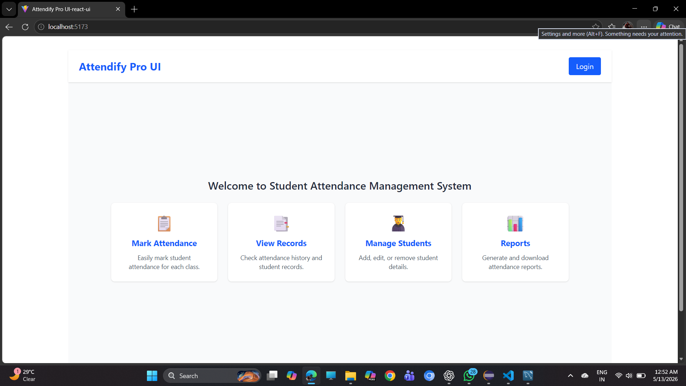
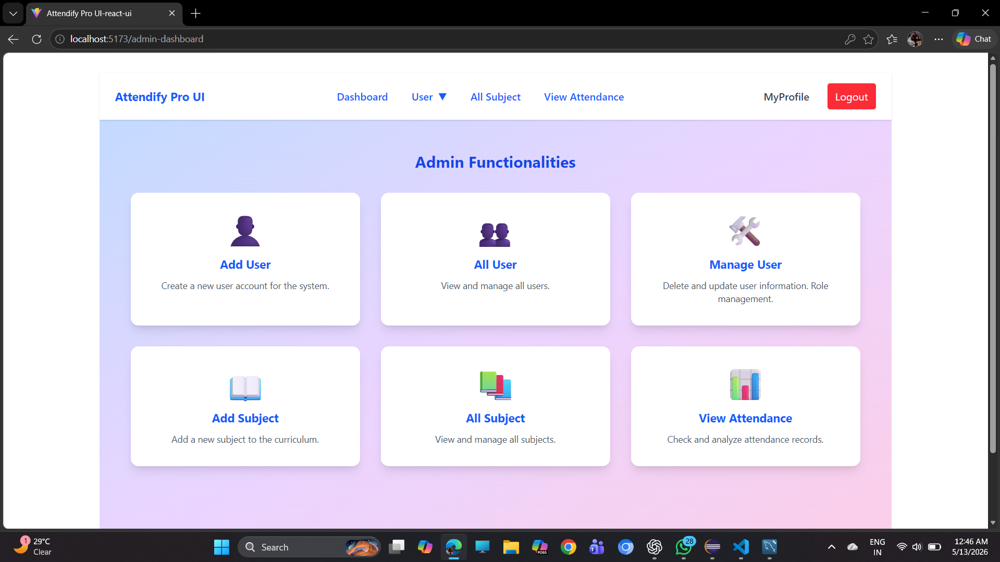
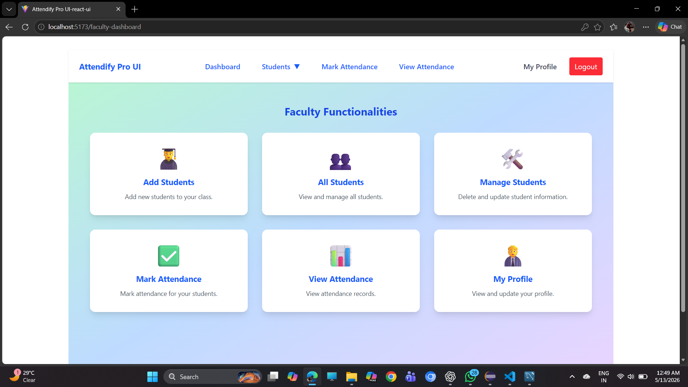
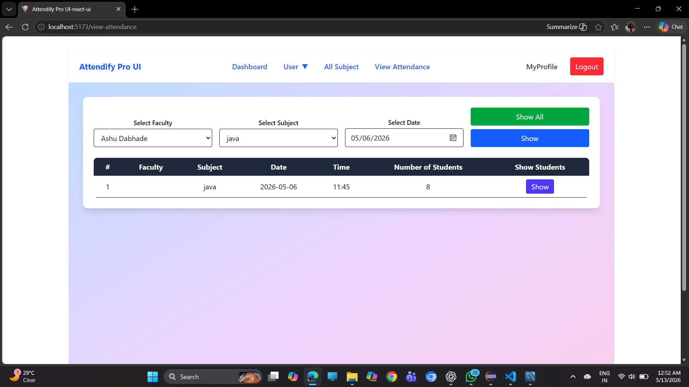

# Attendify — Full Stack Student Attendance Management System

> A modern, production-ready attendance management platform built with **React + Spring Boot + MySQL**.  
> Attendify empowers colleges, institutes, and faculty to manage student attendance digitally with secure JWT authentication, real-time tracking, role-based access control, and insightful dashboards.


---

[Features](#-features) · [Tech Stack](#️-tech-stack) · [Screenshots](#-screenshots) · [Project Structure](#-project-structure) · [Getting Started](#-getting-started) · [API Docs](#-api-endpoints) · [Author](#-author)

---

## 📌 Overview

**Attendify** is a comprehensive, full-stack attendance management system designed for educational institutions. It replaces manual attendance registers with a clean digital workflow — faculty can mark daily attendance, view historical records, generate reports, and manage students and subjects all from a single platform.

Built with a **React + Vite** frontend and a **Java Spring Boot** REST API backed by **MySQL**, Attendify delivers a fast, responsive UI with a secure and scalable server-side architecture.

🎯 **Goal:** Digitize and streamline student attendance management for faculty and administrators — eliminating paperwork, reducing errors, and providing instant analytics.

---

## ✨ Features

### 🔐 Authentication & Security
- JWT-based stateless authentication
- Role-based access control — **Admin** and **Faculty** roles
- Secure password hashing with **BCrypt**
- Protected frontend routes — unauthenticated users redirected to login
- Admin dashboard for full user management

### 👨‍🎓 Student Management
- Add, update, and delete student records
- Manage student details and profiles
- Instant student search functionality

### 📚 Attendance Management
- Mark daily attendance per subject and student
- Present / Absent status tracking
- Full attendance history with date-wise records
- Automatic attendance percentage calculation

### 👨‍🏫 Faculty Dashboard
- Dedicated teacher dashboard view
- View and manage classroom attendance records
- Access student attendance analytics and reports

### 📊 Reports & Analytics
- Attendance summaries per subject and student
- Percentage-based performance overview
- Real-time attendance statistics at a glance

### 🎨 UI & Experience
- Responsive, mobile-friendly design
- Clean dashboard layout with intuitive navigation
- Fast page loads powered by Vite

---

## 🛠️ Tech Stack

### Frontend

| Technology | Purpose |
|---|---|
| React.js | Frontend UI framework |
| Vite | Build tool & dev server |
| React Router DOM | Client-side routing |
| Axios | HTTP client for API calls |
| Bootstrap / CSS | Styling & responsive layout |

### Backend

| Technology | Purpose |
|---|---|
| Java 17 | Programming language |
| Spring Boot 3.x | Application framework |
| Spring Security 6.x | Authentication & authorization |
| JWT (jjwt) | Token-based stateless auth |
| Spring Data JPA | Database ORM |
| Maven | Build & dependency management |

### Database

| Technology | Purpose |
|---|---|
| MySQL 8.x | Primary relational database |

---

## 📸 Screenshots

### 🏠 Welcome Page
> The public landing page — shows the system overview with quick-access cards: Mark Attendance, View Records, Manage Students, and Reports.


---

### 🛡️ Admin Dashboard
> Admins get a full-featured control panel — Add User, All User, Manage User, Add Subject, All Subject, and View Attendance.


---

### 👨‍🏫 Faculty Dashboard
> Faculty members can Add Students, view All Students, Manage Students, Mark Attendance, View Attendance, and update their Profile — all from one place.


---

### 📋 View Attendance
> Filter attendance records by faculty, subject, and date — with a clean tabular view showing session details, time, and number of students present.



```

## 📁 Project Structure

```
attendify-app/
│
├── attendify-frontend/                    # React + Vite frontend
│   │
│   ├── public/
│   │
│   ├── src/
│   │   ├── assets/                        # Static assets (images, icons)
│   │   │
│   │   ├── apiService.js                  # Centralized Axios API service
│   │   │
│   │   ├── App.jsx                        # Root component & route definitions
│   │   ├── App.css
│   │   ├── main.jsx
│   │   ├── index.css
│   │   │
│   │   ├── Login.jsx                      # Authentication pages
│   │   ├── Welcome.jsx
│   │   │
│   │   ├── AdminDashboard.jsx             # Admin role views
│   │   ├── AdminMenu.jsx
│   │   ├── AddUser.jsx
│   │   ├── AllUser.jsx
│   │   ├── UpdateUser.jsx
│   │   │
│   │   ├── FacultyDashboard.jsx           # Faculty role views
│   │   ├── FacultyMenu.jsx
│   │   │
│   │   ├── AddStudent.jsx                 # Student management
│   │   ├── AllStudents.jsx
│   │   │
│   │   ├── AllSubject.jsx                 # Subject management
│   │   │
│   │   ├── MarkAttendance.jsx             # Attendance features
│   │   ├── ViewAttendance.jsx
│   │   │
│   │   ├── Profile.jsx                    # User profile
│   │   └── Footer.jsx
│   │
│   ├── index.html
│   ├── vite.config.js
│   ├── package.json
│   ├── eslint.config.js
│   └── .gitignore
│
└── attendify-backend/                     # Spring Boot backend
    │
    ├── src/main/java/com.tka.attendify.api/
    │   │
    │   ├── AttendifyProApplication.java   # Application entry point
    │   │
    │   ├── controller/                    # REST API controllers
    │   │   ├── AttendanceController.java
    │   │   ├── StudentController.java
    │   │   ├── SubjectController.java
    │   │   └── UserController.java
    │   │
    │   ├── dao/                           # Spring Data JPA repositories
    │   │   ├── AttendanceRecordDao.java
    │   │   ├── StudentDao.java
    │   │   ├── SubjectDao.java
    │   │   └── UserDao.java
    │   │
    │   ├── entity/                        # JPA entities (DB tables)
    │   │   ├── AttendanceRecord.java
    │   │   ├── Student.java
    │   │   ├── Subject.java
    │   │   └── User.java
    │   │
    │   ├── model/                         # DTOs & request models
    │   │   ├── AttendanceRecordDTO.java
    │   │   ├── AttendanceRecordRequest.java
    │   │   ├── LoginRequest.java
    │   │   └── StudentDTO.java
    │   │
    │   └── service/                       # Business logic layer
    │       ├── AttendanceRecordService.java
    │       ├── StudentService.java
    │       ├── SubjectService.java
    │       └── UserService.java
    │
    ├── src/main/resources/
    │   └── application.properties         # DB config, JWT secret
    │
    ├── src/test/java/
    ├── pom.xml
    ├── mvnw
    └── mvnw.cmd
```

---

## 🚀 Getting Started

### Prerequisites

Ensure the following are installed on your machine:

- **Java** 17+
- **Node.js** 18+
- **MySQL** 8+
- **Maven** 3.8+
- **Git**

---

### 1. Clone the Repository

```bash
git clone https://github.com/bhagattushar576/attendify-app.git
cd attendify-app
```

---

### 2. Backend Setup

```bash
cd attendify-backend
```

**Configure the database** — open `src/main/resources/application.properties`:

```properties
spring.datasource.url=jdbc:mysql://localhost:3306/attendify
spring.datasource.username=your_mysql_username
spring.datasource.password=your_mysql_password

spring.jpa.hibernate.ddl-auto=update
spring.jpa.show-sql=true

jwt.secret=your_super_secret_jwt_key_at_least_32_characters
jwt.expiration=86400000
```

**Create the database:**

```sql
CREATE DATABASE attendify;
```

**Run the backend:**

```bash
mvn spring-boot:run
```

✅ Backend starts at `http://localhost:8080`

---

### 3. Frontend Setup

```bash
cd attendify-frontend
npm install
```

**Create a `.env` file** in the frontend root:

```env
VITE_API_BASE_URL=http://localhost:8080
```

**Run the frontend:**

```bash
npm run dev
```

✅ Frontend starts at `http://localhost:5173`

---

### 4. Open the App

Navigate to **http://localhost:5173** and register your first account.

> 💡 To promote a user to **ADMIN** role, run this directly in MySQL:
> ```sql
> UPDATE users SET role = 'ADMIN' WHERE username = 'your_username';
> ```

---

## 📡 API Endpoints

### Authentication

| Method | Endpoint | Description |
|---|---|---|
| `POST` | `/api/auth/register` | Register a new user |
| `POST` | `/api/auth/login` | Login → returns JWT token |

### Students

| Method | Endpoint | Description |
|---|---|---|
| `GET` | `/api/students` | Get all students |
| `POST` | `/api/students` | Add a new student |
| `PUT` | `/api/students/{id}` | Update student details |
| `DELETE` | `/api/students/{id}` | Delete a student |

### Subjects

| Method | Endpoint | Description |
|---|---|---|
| `GET` | `/api/subjects` | Get all subjects |
| `POST` | `/api/subjects` | Add a new subject |
| `DELETE` | `/api/subjects/{id}` | Delete a subject |

### Attendance

| Method | Endpoint | Description |
|---|---|---|
| `POST` | `/api/attendance/mark` | Mark attendance |
| `GET` | `/api/attendance/student/{id}` | Get attendance for a student |
| `GET` | `/api/attendance/all` | Get all attendance records |

### Users (Admin)

| Method | Endpoint | Description |
|---|---|---|
| `GET` | `/api/users` | Get all users |
| `PUT` | `/api/users/{id}` | Update user |
| `DELETE` | `/api/users/{id}` | Delete user |

> 🔒 All endpoints except `/api/auth/*` require a `Bearer <JWT>` token in the `Authorization` header.

---

## 🔑 Environment Variables

### Frontend (`.env`)

```env
VITE_API_BASE_URL=http://localhost:8080
```

### Backend (`application.properties`)

```properties
spring.datasource.url=jdbc:mysql://localhost:3306/attendify
spring.datasource.username=                  # Your MySQL username
spring.datasource.password=                  # Your MySQL password

jwt.secret=                                  # Min 32-character secret key
jwt.expiration=86400000                      # Token expiry in ms (24 hours)
```

---

## 👤 User Roles

| Role | Permissions |
|---|---|
| **ADMIN** | Full system access — manage users, students, subjects, and all attendance records |
| **FACULTY** | Mark attendance, view reports, manage their own classroom records |

---

## 🤝 Contributing

Contributions are welcome! Here's how to get started:

**1. Fork the repository, then clone your fork:**
```bash
git clone https://github.com/YOUR_USERNAME/attendify-app.git
```

**2. Create a feature branch:**
```bash
git checkout -b feature/your-feature-name
```

**3. Make your changes and commit:**
```bash
git add .
git commit -m "feat: add your feature description"
```

**4. Push and open a Pull Request:**
```bash
git push origin feature/your-feature-name
```

### Commit Convention

| Prefix | Purpose |
|---|---|
| `feat:` | New feature |
| `fix:` | Bug fix |
| `docs:` | Documentation update |
| `refactor:` | Code refactor |
| `style:` | UI / styling changes |

---

## 📄 License

This project is licensed under the **MIT License** — see the [LICENSE](LICENSE) file for details.

---

## 👨‍💻 Author

**Tushar Bhagat**

[](https://github.com/bhagattushar576)
[](https://www.linkedin.com/in/bhagat-tushar)

---

> ⭐ **If you found this project helpful, please give it a star on GitHub!**

---

*Made with ❤️ using React, Spring Boot, Java, and MySQL*
